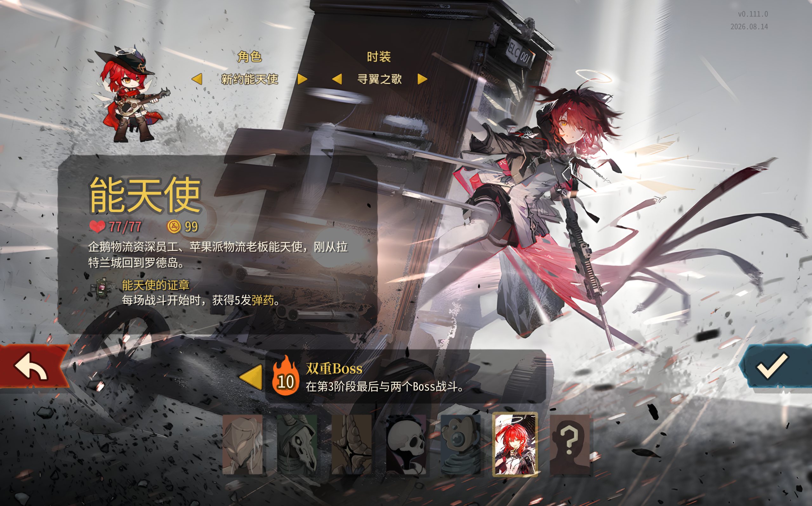
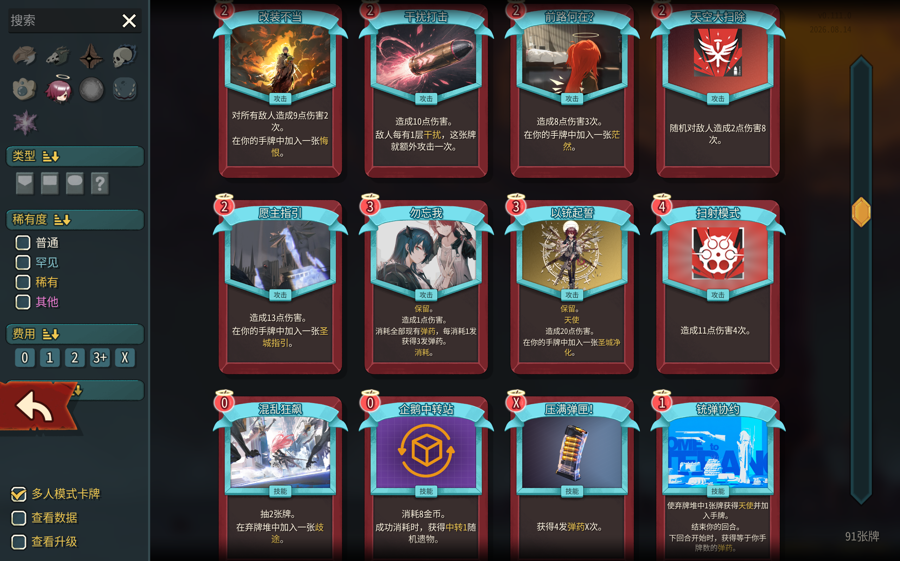

# 能天使 · Exusiai

> 子弹上膛，准备万全★

企鹅物流资深员工、苹果派物流老板能天使，前来《Slay the Spire 2》的高塔拓展业务（真的吗）。这是一个包含简体中文与英文的非官方、非盈利角色 Mod。


## 内容与玩法

- **弹药与过载**：弹药为攻击提供额外伤害；弹药越多，增伤越高。达到上限后进入过载，攻击力提升且不再扣除弹药。
- **天使**：赋予卡牌保留与一次免费打出，配合三张圣城衍生牌组织连招。
- **企鹅物流**：通过快递暂时寄出遗物换取收益，再用中转调度临时遗物；八位企鹅物流成员会以物流卡登场。
- **干扰与沉默**：降低敌人的攻击，并使其被动能力暂时失效。

当前包含 104 张卡牌：91 张角色卡（含 5 张多人卡、初始牌和先古牌）、11 张衍生牌和 2 张诅咒；另有 9 件角色遗物、3 瓶药水，以及能天使与新约能天使两组角色骨骼、共 6 套时装。

| 角色与外观 | 战斗与卡牌 |
| --- | --- |
|  |  |

## 安装与兼容

本 Mod 目前面向游戏测试分支，发布时支持的具体版本以工坊页面为准。前置依赖为 [RitsuLib](https://steamcommunity.com/sharedfiles/filedetails/?id=3747602295)。多人游戏请保持游戏、Mod、依赖版本以及内容 Mod 加载顺序一致。

工坊页面上线后将在这里补充订阅链接。GitHub 的 **Download ZIP 是源码，不是可直接安装的 Mod 包**。若使用维护者提供的手动安装包，请将 `AK_Exusiai.dll`、`AK_Exusiai.pck` 和 `AK_Exusiai.json` 放入游戏的 `mods/AK_Exusiai/`，并安装匹配版本的 RitsuLib。

## 反馈

请通过 [GitHub Issues](https://github.com/Jimmyzzt/AK_Exusiai/issues)、工坊 BUG 反馈帖或交流群说明游戏与 Mod 版本、相关卡牌及升级状态、单人/多人和复现步骤。交流群：QQ 1080295067。

遇到异常时，请附发生问题那次运行的 `godot.log`；多人不同步请同时提供对应的 `ritsulib_state_divergence_*.zip`。游戏控制台输入 `open logs` 可以打开日志目录。

## 开发

项目使用 C#、.NET 9、Godot 4.5.1 Mono 与 RitsuLib。构建与本机环境说明保存在 [开发文档](docs/archive/DEVELOPMENT.md)，当前实现和发布前待办见 [进度记录](docs/PROGRESS.md)，卡图及卡牌特效工具见 [制作工具](tools/README.md)。较大的机制调整建议先讨论设计。

```powershell
dotnet build .\AK_Exusiai.csproj
```

完整构建前请退出游戏。仓库目前没有统一代码许可证；源码公开不代表项目内全部代码和素材获得任意用途的授权。

## 致谢

感谢 Mega Crit、《明日方舟》的创作者、PRTS、RitsuLib 与社区工具维护者，感谢妮芙 Mod 作者提供的参考和帮助，也感谢参与测试和反馈的玩家。

角色、美术、音效与第三方工具各有其来源和权利归属，详见 [素材与致谢](docs/archive/CREDITS.md)。

---

## English

Exusiai of Penguin Logistics is bringing Ammo, Overload, angelic blessings, and a whole logistics crew to the Spire. The mod includes 104 cards, 9 character relics, 3 potions, six appearances across Exusiai and Exusiai the New Covenant, and both Simplified Chinese and English localization.

RitsuLib is required. The mod currently targets the game's beta branch; consult the future Workshop page for the exact supported version. See the [English Workshop description](docs/workshop/description.en.md) for the full feature list and feedback instructions.
