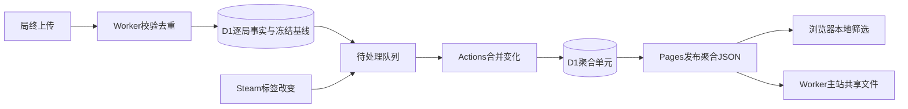

# 统计架构与成本

更新：2026-10-09。操作见[维护入口](../README.md)，公式见[指标方法](METRICS.md)，最新生产验证只记入[项目进度](../../docs/PROGRESS.md)。

## 当前数据流

上传保留脱敏逐局数据和索引明细，按局ID去重；新局入队，Steam标签变化只将相关局入队。维护读取该局的新事实和旧贡献，撤销旧贡献再加入新贡献。合并在Actions内存完成，Worker校验分块并原子提交汇总、贡献账本和队列删除。

若新旧贡献完全相同，只确认当前队列代次，不重写汇总或递增统计修订；并发新变化留在队列。队列清空后按修订导出相对上一发布的变化，再生成公开文件。比率、均值、趋势斜率在加总后计算，预测不重新训练。

公开文件经白名单、模式、字节数、SHA256校验，与网页一起部署Pages。浏览器下载一次后本地筛选；刷新只读manifest，哈希变了才下载JSON。Worker主站共享同一发布。上传、维护、Steam同步、访客读取是四种不同工作：**Cloudflare Cron目前只同步Steam，不合并统计或调用GitHub；统计由GitHub schedule/手动触发。**

## 数据库保存内容

| 类别 | 表 | 用途 |
| --- | --- | --- |
| 原始对局 | `runs`、`entities` | 脱敏payload、结果/版本/进阶/时长、卡牌/遗物计数；去重局ID和安装摘要只在私库 |
| v2明细 | `run_details`、`run_acts`、`act_decks`、`detailed_entities`、`card_offers`、`fights` | 第三幕、幕末持有、升级、奖励层数、战斗损血/回合；规范化明细用于索引查询 |
| 环境与目录 | `cohorts`、`cohort_mods`、`mod_catalog`、`enrichment_state` | 环境及Mod关系、工坊ID/官方标签/使用局数、Steam限速状态 |
| 预测基线 | `skill_models`、`survival_baselines`、`fight_baselines` | 上传前个人/楼层/遭遇模型；预期胜率和战斗期望冻结在明细中 |
| 增量账本 | `stat_facts` | 每局充分贡献及算法，供撤销旧贡献；为维护速度增加的副本 |
| 聚合缓存 | `stat_cells` | 日期/版本/进阶/人数/模式/放弃/标签分组数字、Mod单项与常用双项交集，主要空间开销 |
| 维护控制 | `stat_dirty`、`stat_state`、`stat_work`、`stat_work_chunks` | 队列、修订/预算/租约、私有暂存块；未完成事务不公开 |
| 旧兼容 | `cohort_entities`、`snapshots`、`revoked_owners` | 首版汇总、快照和撤销结构；接口退役，旧数据未清理，部分旧汇总仍随上传维护 |

数据库已经保存“每一局”。总大小还包含规范化副本、基线、贡献账本、预计算、索引与SQLite页面。当前并非为每一种访客筛选缓存一个结果，而是保存可组合的充分统计。

本轮只读体积核对：112局原始payload约2.14MB，109份贡献账本约4.59MB，2905个聚合单元payload约23.22MB，临时工作/分块均为空，数据库已分配文件约43.73MB。前三项是文本长度而非整个表或文件大小，未包含规范化明细、索引及页面开销；主要派生空间来自汇总，并非原局重复接收。

## 为什么Mod筛选增加空间

原始Mod列表本身不昂贵。额外空间来自为公众本地筛选预计算的交集：总量S，启用A的量SA，同时启用A/B的量SAB。排除A为`S−SA`，排除A/B为`S−SA−SB+SAB`。没有SAB就不知道重叠，直接两次扣除会算错。

一局有m个可筛选Mod、其中k个属于常用6项，最多贡献`1+m+k(k−1)/2`组，另有幕数和升级视图。多Mod玩家会增加后台维护读写和存储；**浏览器执行一次筛选不增加D1读取。** 全部单项和常用6项双项有精确交集，其他组合明确不支持；标签分类掩码支持黑白名单，自身/RitsuLib不参与排除。

## 直接筛选原局是否可行

可行，Mod组合在数学上不要求预计算。选择取决于在哪里计算：

| 方式 | 优点 | 代价 |
| --- | --- | --- |
| 原局存D1，访客请求时SQL计算 | 直观、任意组合、额外缓存少 | 每次未命中扫描明细，访问量/组合数使成本不确定，需索引/缓存/限流 |
| 后台周期批量读原局，发布聚合 | 集中计算，公众不读D1 | 每轮全量读；任意组合需足够分组信息，精确组合分组可能接近每局一组 |
| 当前贡献账本+增量交集+静态文件 | 只维护新/失效局，访客不读D1，可撤销旧贡献 | 存储和代码更多，组合覆盖有限 |

原局直接发浏览器再算最灵活，但违反只公开聚合的范围。另一条路是按完整Mod组合分组后发布聚合包，可减少交集复制；实际组合很分散、常为小组，下载和计算量随历史增长，需要实测及复核公开粒度。

**当前是免费成本、静态部署和公开范围的取舍，不是唯一方案。** 百余局时偏复杂。若以后优先任意组合，应比较完整组合分组或后台查询服务，而不是无限增加交集。

## 已做的优化

- 旧SQL在关联卡牌时反复执行同局幕数/胜利/扩展幕的相关子查询。生产四类查询累计约509万扫描行；请求少仍超额。旧公开重算`/api/stats`已410。
- 队列和逐局贡献替代反复全量扫描；Actions承担合并CPU，Worker使用租约、队列代次、修订和事务防重复/漏更新。
- 按`(revision,key)`复合索引读变化，不用OFFSET；每页最多2单元，合批减少往返。导出固定一致目录，后续新入队留下一轮。
- 无损编码省零、共享相同幕数/升级视图；公开模式2再共享块，数值精度和内部模式1不变。维护传输也压缩并完整校验。
- 哈希/manifest/IndexedDB只下载新版本，失败保留有效旧版。GET网络、短暂状态码或JSON中断有界重试，写请求不自动重放；无变化跳过部署。
- 标签更新后贡献相同即跳过汇总读写，避免库存更新重复写多份数字。

2026-10-09转换1911个聚合单元，原局未删，D1文件87.11MB降到33.38MB，后续新数据增长到约39.64MB。13:23公开JSON1.28MB，该轮8840行读/1348行写；无变化8行读/3行写。这是具体测量，不是所有局的固定成本。

## 行业参考与本项目建议

通行数据管线把原始事实、转换层、服务层分开，并以唯一键处理重复及更新。[dbt分层建议](https://docs.getdbt.com/best-practices/how-we-structure/1-guide-overview)及[增量模型](https://docs.getdbt.com/docs/build/incremental-models)支持新/变更记录增量处理，复杂优化应依据数据规模和查询模式。这里原始数据保留、去重和可重建是正确方向。

[ClickHouse增量视图](https://clickhouse.com/docs/materialized-view/incremental-materialized-view)明确把查询计算移到写入端；它不是免费计算。维度表更新不会自动触发源表视图，因此Steam标签更改要明确失效/重建，不能只更新标签文字。聚合保存计数、和、回归充分量，最终计算比率，避免平均值再平均。

[DuckDB-Wasm](https://duckdb.org/docs/stable/clients/wasm/overview)证明浏览器本地分析是一条成熟路径，但查询引擎不会决定数据能否公开，也不消除下载成本。当前1–2MB聚合JSON可由现有JavaScript完成；无需为采用通行做法而更换数据库或引入Wasm。

本项目应继续私库存事实、后台批处理、静态交付、明确口径/版本/样本覆盖，并测量实际扫描行、写入、包大小和数据新鲜度。下一次架构调整优先实测“完整Mod组合分组”能否去掉交集限制和复制，保留现有数据验证等价后再迁移。调度稳定性和预算下的新鲜度优先于更多预计算维度；不把百余局系统直接扩成实时大数据平台。

周期全量刷新也是合理工具：[ClickHouse可刷新视图](https://clickhouse.com/docs/concepts/features/materialized-views/refreshable-materialized-view)用于按计划重算复杂转换，不必所有阶段都做增量。可先批量读取私有逐局贡献，在后台合并，而不是让每次公众筛选重扫多表；是否替换当前交集方案，需要真实包大小、公开粒度及成本对比。

[dbt新鲜度检查](https://docs.getdbt.com/docs/deploy/source-freshness)将时效与任务是否执行分开检查。这里应区分入库时间、维护完成时间、公开版本生成时间，并发现“仍在收局但发布没执行”。配置Cron、测试通过或没有失败邮件，都不代表数据按时更新；本轮已明确日志阶段，独立可靠调度/时效监控尚未配置。

## 预算与时效

普通维护本轮约1.8万读取保护，导出/整轮约2万；手动bootstrap扩大本轮保护。维护日保护180万行读/3万行写，给上传、Steam和账号其他库留余量；SQL后计量，不是全账号硬额度。达到保护会留队列和旧发布。

本日初始化消耗较多：15:47维护写入计量29105，距离3万保护约895行；同日截至15:52，本库查询分析报告约62597行写入。后者还包含上传、Steam、控制计量及其他维护操作，未覆盖账号其他库，不可用维护计量冒充Cloudflare实际用量。若后续保护暂停，应结合真实账号用量调整预算或减少派生写入；本轮没有提高预算或升级套餐。

当前免费D1每日500万行读/10万行写、单库500MB，Worker免费单请求CPU10ms。[D1计量](https://developers.cloudflare.com/d1/platform/pricing/) · [D1限制](https://developers.cloudflare.com/d1/platform/limits/) · [Workers限制](https://developers.cloudflare.com/workers/platform/limits/)。每天UTC00:00，即北京时间08:00重置；容量满不能等待每日恢复解决。

公开文件64MiB及维护分块有体积保护，触发后保留原局和旧版，需明确改分块。GitHub约15分钟计划可能延迟/丢弃；active及手动成功均不是schedule证据。[GitHub说明](https://docs.github.com/en/actions/reference/workflows-and-actions/events-that-trigger-workflows#schedule)。页面时间是最后成功生成时间，无变化不更新；排查结合Actions、原局数、队列和修订。

历史故障只留结论：首次40条积压误报失败、展开包过大、标签更新取消快照、临时503、之后未调度。已修复正常暂停、紧凑编码、固定快照和读取重试；定时恢复必须以真实schedule运行验证。
